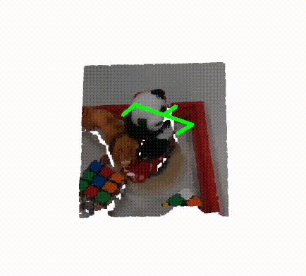
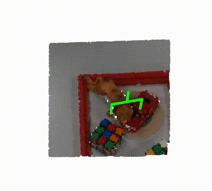
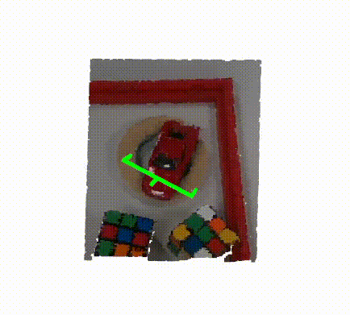

# Free-form language-based robotic reasoning and grasping (IROS 2025)
This is the official repository for the paper: Free-form language-based robotic reasoning and grasping.

Project webpage: https://tev-fbk.github.io/FreeGrasp/

[Paper](https://arxiv.org/abs/2503.13082) | [Video](https://www.youtube.com/watch?v=97RHsnJSDzw)


In this paper, we explore these research questions via the free-form language-based robotic grasping task, and propose a novel method, FreeGrasp, leveraging the pre-trained VLMs’ world knowledge to reason about human instructions and object spatial arrangements.

Our method detects all objects as keypoints and uses these keypoints to annotate marks on images, aiming to facilitate GPT-4o’s zero-shot spatial reasoning. This allows our method to determine whether a requested object is directly graspable or if other objects must be grasped and removed first. Since no existing dataset is specifically designed for this task, we introduce a synthetic dataset FreeGraspData by extending the MetaGraspNetV2 dataset with human-annotated instructions and ground-truth grasping sequences. We conduct extensive analyses with both FreeGraspData and real-world validation with a gripper-equipped robotic arm, demonstrating state-ofthe-art performance in grasp reasoning and execution.


#### Contact
If you have any questions, please contact us at rjiao@fbk.eu.

## Setup
### Installation Requirements

- Torch 2.4.1, Torchvision 0.19.1
- CUDA 12.4
- GTX 3090 or RTX A4000 with 24GB memory for the complete pipeline (real-world)
- Minimum 18GB GPU memory for synthetic reasoning

### Installation Step
1. **Create Conda environment**:  
   ```bash
   conda create -n freegrasp python=3.10
   conda activate freegrasp
   ```  

1. **Install PyTorch**
   ```bash
   conda install pytorch==2.4.1 torchvision==0.19.1 torchaudio==2.4.1 pytorch-cuda=12.4 -c pytorch -c nvidia
   ```  

1. **Install GraspNet requirements**  
   ```bash
   cd models/FGC_graspnet
   pip install -r requirements.txt
   cd pointnet2
   python setup.py install
   cd ../knn
   python setup.py install
   cd ../../..
   ``` 

1. **Install LangSAM requirements** 
   ```bash
   cd models/langsam
   pip install -r langsam.txt
   git clone https://github.com/IDEA-Research/GroundingDINO.git
   cd GroundingDINO
   pip install -e .
   ```

1. **Install GraspNetAPI**  
   ```bash
   cd models
   git clone https://github.com/graspnet/graspnetAPI.git
   cd graspnetAPI
   pip install .
   ```  

1. **Set Your OpenAI API Key**:  
   ```bash
   export OPENAI_API_KEY="sk-xxxxx"
   ```

### Potential Issues of Installation
The dependencies of this repository mainly come from LangSAM and GraspNet. In addition, this code is built upon [ThinkGrasp](https://github.com/H-Freax/ThinkGrasp). For more Installation-related issues, please follow the instructions of the original repositories.

1. `AttributeError: module 'numpy' has no attribute 'float'`  

- **Cause**: Deprecated usage of `numpy.float`.  
- **Solution**:  
  Update the problematic lines in the file (e.g., `transforms3d/quaternions.py`):  
  ```python
  _MAX_FLOAT = np.maximum_sctype(np.float64)
  _FLOAT_EPS = np.finfo(np.float64).eps
  ```  
2. `_stack_dispatcher() got an unexpected keyword argument 'dtype'`  
- **Solution**:  make sure that   ```numpy==1.24.4```  is installed
  
  
## Dataset
Download the FreeGrasp data from: 
- [HuggingFace Dataset](https://huggingface.co/datasets/FBK-TeV/FreeGraspData)  
- [Google Drive](https://drive.google.com/drive/folders/1w5cZAfY9h0O9908y9YvL88KIPL_7J7EF?usp=sharing)  

We provide dataset on HF with parquet format, please check the instructions in `download_data.ipynb` notebook.

**Download dataset**:  
   ```bash
   download train-00000-of-00002.parquet, train-00001-of-00002.parquet and npz_file.zip
   ```  

Place the downloaded files in the `data` folder. The structure should as follows:

   ```
FreeGrasp
└── data
    ├── npz_file
    ├── train-00000-of-00002.parquet
    └── train-00001-of-00002.parquet
   ```  

## Running demo

1. **Install requirements**
   ```bash
   pip install gradio
   ```

1. **Run the demo**:
   ```bash
   python3 demo.py
   ```
   

## Running on dataset (synthetic)
You can run each task individually by executing the following scripts:

1. **Object localization and visual prompt generation (Molmo):**
   ```bash
   python molmo_eval.py
   ```

1. **Grasp reasoning and object segmentation:**
   ```bash
   python reasoning_eval.py
   ```

1. **Success rate calculation:**
   ```bash
   python calculate_SR.py
   ```

Alternatively, you can run the complete evaluation pipeline with a single command:
   ```bash
   python evaluate.py
   ```
 
## Running on complete pipeline (real world)

1. **Download checkpoint of grasp model**:  
Download `checkpoint_fgc.tar` from [Google Drive](https://drive.google.com/drive/folders/1w5cZAfY9h0O9908y9YvL88KIPL_7J7EF?usp=sharing).
Place it in folder `/logs`

1. **Run a complete pipeline**:  
    ```bash
    python run.py
    ```  

If you want to run the code on your own examples, make sure to update the intrinsic parameters and file paths accordingly.


**Input image, depth and instruction (take the red car). Output grasp pose**:  

<table align="center">
  <tr>
    <td align="center"><br><b>Step 1</b></td>
    <td align="center"><br><b>Step 2</b></td>
    <td align="center"><br><b>Step 3</b></td>
  </tr>
</table>

For more info please check the folder `data/real_examples/hard`

---

# License

This code is under **CC BY-NC 4.0 license**. You may only use the code for academic purposes. Any kind of commercial or military usage forbidden. For more details see https://creativecommons.org/licenses/by-nc/4.0/.

---


## Citation

If you find this work useful, please consider citing:  
```bibtex
@article{jiao2025free,
  title={Free-form language-based robotic reasoning and grasping},
  author={Jiao, Runyu and Fasoli, Alice and Giuliari, Francesco and Bortolon, Matteo and Povoli, Sergio and Mei, Guofeng and Wang, Yiming and Poiesi, Fabio},
  journal={IEEE/RSJ International Conference on Intelligent Robots and Systems (IROS)},
  year={2025}
}
```
